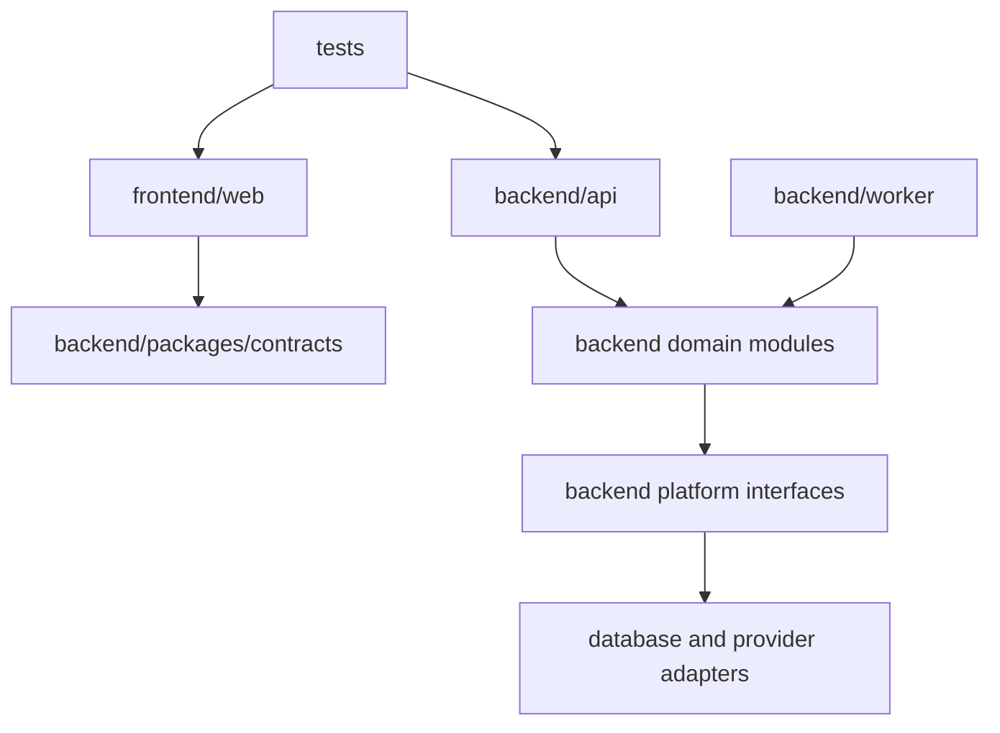

# Project Structure

## Repository model

Zorfly uses a monorepo so contracts, application changes, migrations, tests, and
deployment definitions can evolve atomically. pnpm workspaces and Turborepo will
be introduced during application bootstrap; they are not included in the
foundation phase.

## Current structure

```text
.
├── .github/
│   ├── CODEOWNERS
│   └── PULL_REQUEST_TEMPLATE.md
├── backend/
├── database/
├── docker/
├── docs/
│   ├── ARCHITECTURE.md
│   ├── CODING_STANDARDS.md
│   ├── IMPLEMENTATION_PLAN.md
│   ├── PROJECT_STRUCTURE.md
│   └── TECH_STACK.md
├── frontend/
├── scripts/
├── tests/
├── .editorconfig
├── .gitignore
├── CONTRIBUTING.md
├── README.md
└── SECURITY.md
```

Empty implementation directories contain `.gitkeep` files only. No application
code exists.

## Planned structure

The following structure is a target for the bootstrap phase, not a request to
create these files now:

```text
frontend/
└── web/
    ├── app/
    ├── components/
    ├── features/
    ├── lib/
    └── tests/

backend/
├── api/
│   └── src/
│       ├── modules/
│       ├── platform/
│       └── main.ts
├── worker/
│   └── src/
└── packages/
    ├── contracts/
    ├── observability/
    ├── security/
    └── testing/

database/
├── migrations/
├── prisma/
├── seeds/
└── tests/

tests/
├── contract/
├── e2e/
├── performance/
└── security/

docker/
├── development/
└── production/

scripts/
├── ci/
├── development/
└── operations/
```

## Directory responsibilities

### `docs/`

Human-readable architecture, engineering policy, runbooks, threat models, and
ADRs. Documentation changes are reviewed with the code or infrastructure they
describe.

### `frontend/`

Browser-facing Zorfly applications. Frontend code may depend on generated or
shared public contracts, design-system packages, and browser-safe utilities. It
must not depend on backend implementations or server-only packages.

### `backend/`

Synchronous APIs, asynchronous workers, domain modules, and server-only shared
packages. Each domain module owns its application interfaces and persistence
access.

### `database/`

Schema definitions, migrations, seed definitions, database policies, and
database-specific tests. Production data and database dumps are never committed.

### `tests/`

Tests that cross deployable-unit boundaries: end-to-end, contract, performance,
resilience, and tenant-isolation suites. Unit and component tests live beside the
code they verify.

### `.github/`

Repository governance, pull request templates, issue templates, dependency
automation, and CI/CD workflows.

### `docker/`

Container build definitions and local development composition. Images are
minimal, non-root, reproducible, scanned, and separated into build and runtime
stages.

### `scripts/`

Portable, documented automation for development, CI, and operations. Scripts
must be non-interactive by default in CI, fail safely, and avoid hidden
environment assumptions.

## Dependency rules



- Domain modules do not import web, controller, ORM, cloud SDK, or framework
  implementations.
- Modules do not access another module's tables or repository implementation.
- Shared packages contain stable cross-cutting capability, not miscellaneous
  helpers.
- Contracts do not import application implementations.
- Circular package or module dependencies fail CI.
- Infrastructure adapters depend inward on interfaces.

## Ownership

CODEOWNERS begins with the repository owner and must evolve to teams as the
organization grows. Sensitive areas require specialist reviewers:

- identity and security;
- database schema and migrations;
- infrastructure and deployment;
- public API and event contracts;
- billing and audit systems when introduced.

## Adding a new module

Before adding a module:

1. define its business capability and owner;
2. document its public commands, queries, and events;
3. identify its data ownership and tenant boundary;
4. define authorization and audit requirements;
5. establish unit, integration, contract, and operational tests;
6. add an ADR if the boundary affects multiple teams or deployable units.

## Generated content

Generated clients, schemas, and documentation must:

- come from a committed source contract;
- be reproducible with one documented command;
- carry a generated-file notice;
- be checked for drift in CI;
- be committed only when consumers cannot generate them reliably during build.
